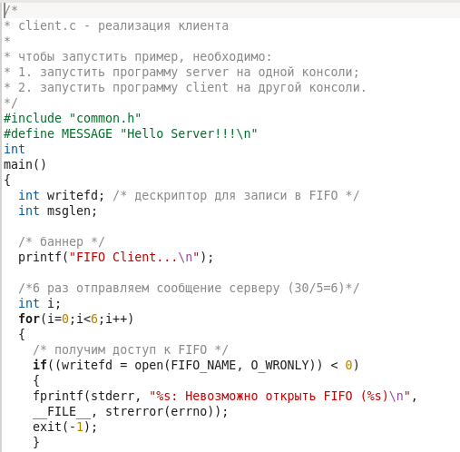
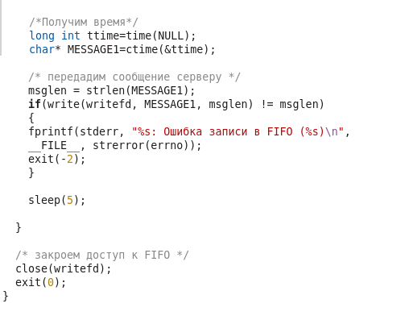
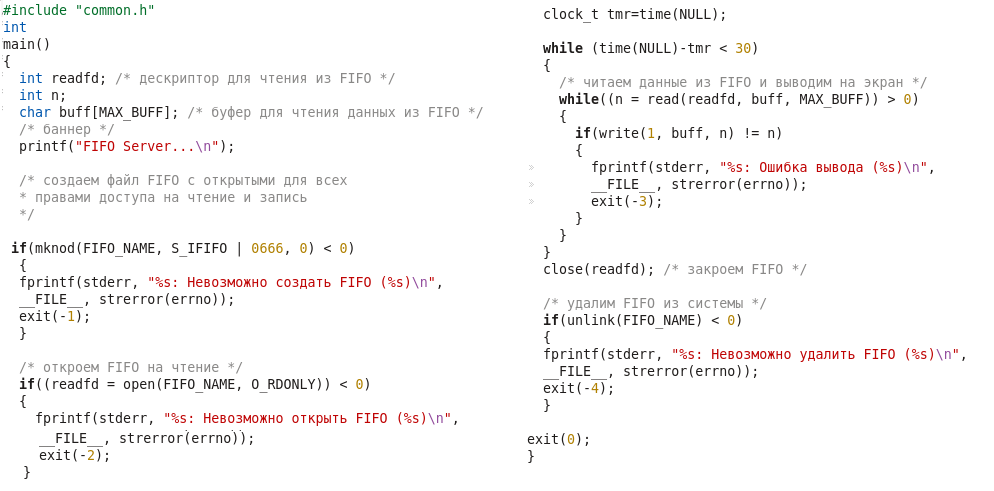

<!-- _class: titleslide -->
# Лабораторная работа №15
### Выполнил Гамаюнов Никита, 1032201719, НПМбд-01-20

---
# Прагматика выполнения работы
**Цель работы**
Приобретение практических навыков работы с именованными каналами.

**Задания**
1. Изучить пример из методических материалов.
2. На его основе написать новые программы, доработав существующие так, что:
   1.  Работает не 1 клиент, а несколько (например, два);
   2. Клиенты передают текущее время с некоторой периодичностью (например, раз в пять секунд). Использовать функцию sleep();
   3. Сервер работает не бесконечно, а прекращает работу через некоторое время (например, 30 сек). Использовать функцию clock().
   
---

# Процесс выполнения работы
1. Для корректной работы программ нужно подключить ещё несколько библиотек, - в файл common.h добавил `unistd`, чтобы можно было пользоваться sleep() и `time.h` для функции clock()

    

---

2. В файл client.c добавил остановку с помощью sleep и зациклил всю работу с FIFO так, чтобы цикл повторился 6 раз 

     

---

3. Реализовал ограничение работы сервера в файле server.c:

    

---

4. Проверил работу скриптов:
   
    

---

<!-- _class: titleslide -->
# Выводы
В ходе выполнения лабораторной работы я приоблёл практические навыки работы с именованными каналами.