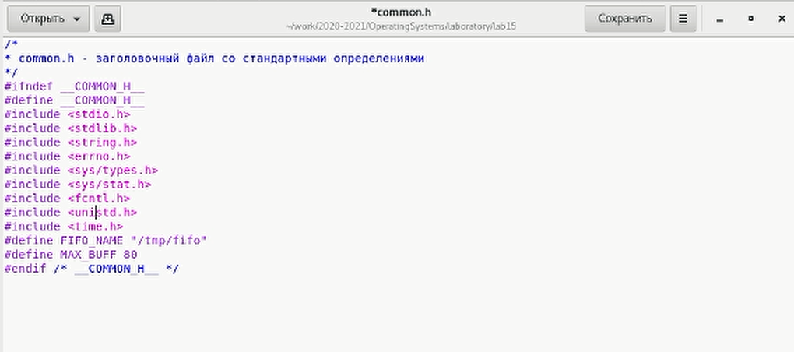
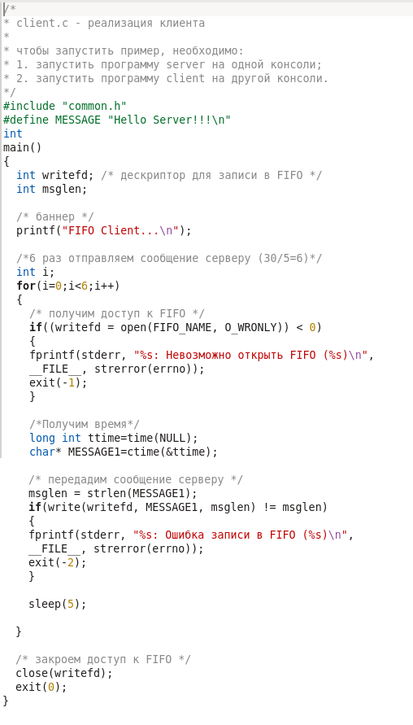
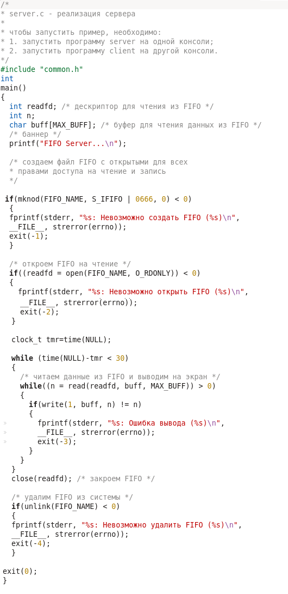
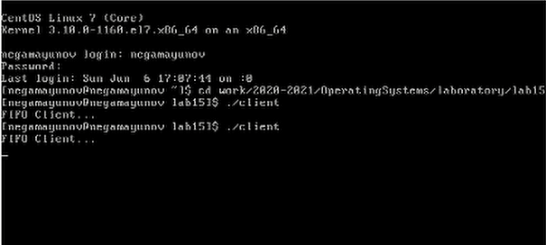
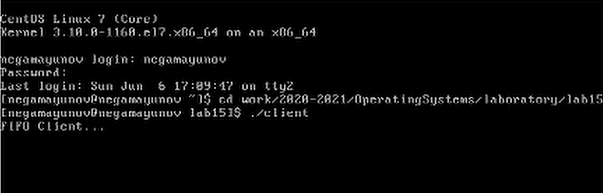
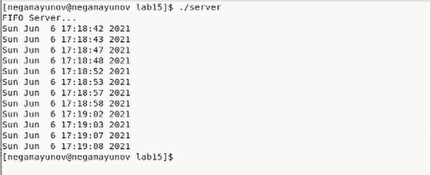

 

# Лабораторная работа №15 

**По дисциплине Операционнные системы** 

Выполнил Гамаюнов Н.Е., студент ФФМиЕН РУДН, НПМбд-01-20, 1032201717

Преподаватель Кулябов Дмитрий Сергеевич

Москва, 2021 г.

 

# Цель работы
Приобретение практических навыков работы с именованными каналами.

# Задания
1. Изучить пример из методических материалов.
2. На его основе написать новые программы, доработав существующие так, что:
   1.  Работает не 1 клиент, а несколько (например, два);
   2. Клиенты передают текущее время с некоторой периодичностью (например, раз в пять секунд). Использовать функцию sleep();
   3. Сервер работает не бесконечно, а прекращает работу через некоторое время (например, 30 сек). Использовать функцию clock().

# Выполнение лабораторной работы

1. Изучил пример.
2. Доработал существующие программы:

    - Для корректной работы программ нужно подключить ещё несколько библиотек, - в файл common.h добавил `unistd`, чтобы можно было пользоваться sleep() и `time.h` для функции clock() *(рисунок 1)*

        

        Рисунок 1.

    - В файл client.c добавил остановку с помощью sleep и зациклил всю работу с FIFO так, чтобы цикл повторился 6 раз (по условию мы знаем, что сервер будет работать 30 секуднд, при этом сообщения серверу отправляются раз в 5 секунд, - клиент должен отправить 6 сообщений) *(рисунок 2)*

        

        Рисунок 2.

    - Реализовал ограничение работы сервера в файле server.c: сначала мы засекаем время начала работы в переменную tmr типа clock_t, затем начинаем цикл с предусловием: как только разница во времени между текущим временем и временем начала работы в tmr превышает 30 секунд, сервер прекращает работу

        

        Рисунок 3.

    - Протестировал работу скриптов: запустил сервер в графическом терминале, и два клиента - в двух текстовых *(рисунки 4-6)*

        

        Рисунок 4.

        

        Рисунок 5.

        

        Рисунок 6. Как мы видим, время вывелось на экран 12 раз, это 2*6, а значит, оба клиента отправили все нужные сообщения, а сервер из корректно вывел.

# Выводы 
В ходе выполнения лабораторной работы я приоблёл практические навыки работы с именованными каналами.

# Контрольные вопросы

1. Именованные каналы отличаются от неименованных наличием идентификатора канала, который представлен как специальный файл (соответственно имя именованного канала — это имя файла)
2. Да, процессы можно объединять символом `|`
3. Чтобы создать именованный канал используется команда `mkfifo` либо команда `mknod` с типом файла p.
4. Неименованный канал является средством взаимодействия между связанными процессами - родительским и дочерним. Родительский процесс создает канал при помощи системного вызова:
   
         int pipe(int fd[2])
    Источник - [life-prog.ru](https://life-prog.ru/view_linux.php?id=21)

5. Файлы именованных каналов создаются функцией mkfifo() или
функцией mknod:

    `int mkfifo(const char *pathname, mode_t mode);`, 
 
    где первый параметр − путь, где будет располагаться FIFO (имя файла,
идентифицирующего канал), второй параметр определяет режим
работы с FIFO (маска прав доступа к файлу),

    `mknod (namefile, IFIFO | 0666, 0)`, где `namefile` − имя канала, `0666` − к каналу разрешен доступ на запись и на чтение любому запросившему процессу),

    `int mknod(const char *pathname, mode_t mode, dev_t dev);`.
Функция `mkfifo()` создает канал и файл соответствующего типа. Если указанный файл канала уже существует, `mkfifo()` возвращает -1. После создания файла канала процессы, участвующие в обмене данными,
должны открыть этот файл либо для записи, любо для чтения.

    Источник - [habr.com](https://habr.com/ru/post/122108/)

6. Каналы FIFO и обычные каналы работают по следующим правилам:

   1. При чтении меньшего числа байтов, чем находится в канале или FIFO, возвращается требуемое число байтов, остаток сохраняется для последующих чтений.

   2. При чтении большего числа байтов, чем находится в канале или FIFO, возвращается доступное число байтов. Процесс, читающий из канала, должен соответствующим образом обработать ситуацию, когда прочитано меньше, чем заказано.

         Источник - [wikireading.ru | FIFO](https://it.wikireading.ru/6594)

7.  1. Запись числа байтов, меньшего емкости канала или FIFO, гарантированно атомарно. Это означает, что в случае, когда несколько процессов одновременно записывают в канал, порции данных от этих процессов не перемешиваются.

    2. При записи большего числа байтов, чем это позволяет канал или FIFO, вызов write(2) блокируется до освобождения требуемого места. При этом атомарность операции не гарантируется. Если процесс пытается записать данные в канал, не открытый ни одним процессом на чтение, процессу генерируется сигнал SIGPIPE, а вызов write(2) возвращает 0 с установкой ошибки (errno=ERRPIPE) (если процесс не установил обработки сигнала SIGPIPE, производится обработка по умолчанию — процесс завершается).

          Источник - [wikireading.ru | FIFO](https://it.wikireading.ru/6594)

8. Количество процессов, которые могут параллельно присоединяться к любому концу канала, не ограничено, правда, есть ограничения на объём записываемой информации.

9. Функция write записывает байты count  из  буфера  buffer  в файл, связанный с handle. Операции write начинаются с текущей позиции  указателя  на файл (указатель ассоциирован с заданным файлом). Если файл открыт для добавления, операции выполняются в конец файла. После осуществления операций записи указатель на  файл (если он есть) увеличивается на количество действительно записанных байтов.

    Единица в вызове функции из server.c означает идентификатор  потока вывода.

    Источник - [codenet.ru | write](http://codenet.ru/progr/cpp/spru/write.php)

10. Функция strerror интерпретирует номер ошибки, передаваемый в функцию в качестве аргумента — errornum, в понятное для человека текстовое сообщение (строку). Откуда берутся эти ошибки? Ошибки эти возникают при вызове функций стандартных Си-библиотек. То есть хорошим тоном программирования будет — использование этой функции в паре с другой, и если возникнет ошибка, то пользователь или программист поймет как исправить ошибку, прочитав сообщение функции strerror.

        char * strerror( int errornum );

    Возвращенный указатель ссылается на статическую строку с ошибкой, которая не должна быть изменена программой. Дальнейшие вызовы функции strerror перезапишут содержание этой строки. Интерпретированные сообщения об ошибках могут различаться, это зависит от платформы и компилятора.

    Источник - [cppstudio.com | strerror](http://cppstudio.com/post/669/)

>*Основной источник всей информации, которой я пользовался для ответа на вопросы и выполнения работы - [Методические рекомендации к лабораторной работе №15](https://esystem.rudn.ru/pluginfile.php/1142102/mod_resource/content/1/013-ipc-fifo.pdf)*

# Библиография

- [Кулябов Д.С. и др. Операционные системы. Методические рекомендации к лабораторной работе №15](https://esystem.rudn.ru/pluginfile.php/1142102/mod_resource/content/1/013-ipc-fifo.pdf)
- [life-prog.ru](https://life-prog.ru/view_linux.php?id=21)
- [habr.com](https://habr.com/ru/post/122108/)
- [wikireading.ru | FIFO](https://it.wikireading.ru/6594)
- [codenet.ru | write](http://codenet.ru/progr/cpp/spru/write.php)
